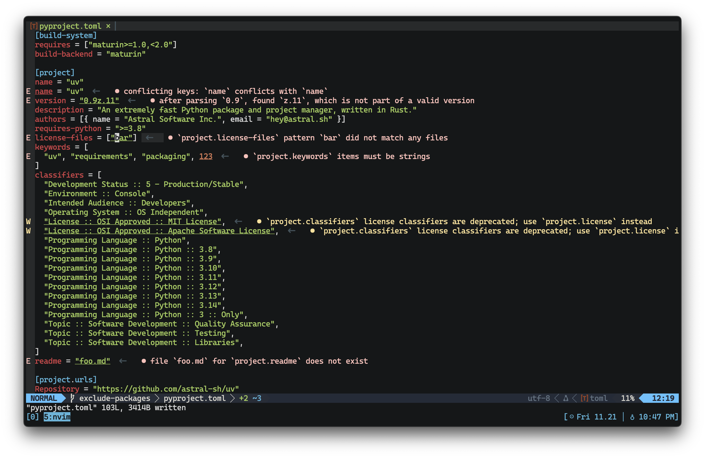

## pyproject

[](https://github.com/terror/pyproject/releases/latest)
[](https://crates.io/crates/pyproject)
[](https://github.com/terror/pyproject/actions/workflows/ci.yaml)
[](https://codecov.io/gh/terror/pyproject)
[](https://github.com/terror/pyproject/releases)
[](https://deps.rs/repo/github/terror/pyproject)

**pyproject** is a linter and language server for
[`pyproject.toml`](https://packaging.python.org/en/latest/guides/writing-pyproject-toml/)
files.



The
[`pyproject.toml`](https://packaging.python.org/en/latest/guides/writing-pyproject-toml/)
specification has become
[increasingly more complex](https://peps.python.org/pep-0725/) over time.
Although tools apply their own validation rules, there is no standard way to
surface useful configuration errors/warnings directly in an editor before those
tools run. This language server (and linter) provides real-time feedback on
configuration issues as you edit your project file, helping you catch errors
early and maintain clearer, more reliable builds.

## Installation

`pyproject` should run on any system, including Linux, MacOS, and the BSDs.

The easiest way to install it is by using
[cargo](https://doc.rust-lang.org/cargo/index.html), the Rust package manager:

```bash
cargo install pyproject
```

Otherwise, see below for the complete package list:

#### Cross-platform

<table>
  <thead>
    <tr>
      <th>Package Manager</th>
      <th>Package</th>
      <th>Command</th>
    </tr>
  </thead>
  <tbody>
    <tr>
      <td><a href=https://www.rust-lang.org>Cargo</a></td>
      <td><a href=https://crates.io/crates/pyproject>pyproject</a></td>
      <td><code>cargo install pyproject</code></td>
    </tr>
    <tr>
      <td><a href=https://brew.sh>Homebrew</a></td>
      <td><a href=https://github.com/terror/homebrew-tap>terror/tap/pyproject</a></td>
      <td><code>brew install terror/tap/pyproject</code></td>
    </tr>
  </tbody>
</table>

### Pre-built binaries

Pre-built binaries for Linux, MacOS, and Windows can be found on
[the releases page](https://github.com/terror/pyproject/releases).

## Prior Art

This project was inspired by a language server I saw for
[`Cargo.toml`](https://doc.rust-lang.org/cargo/reference/manifest.html) files,
namely [crates-lsp](https://github.com/MathiasPius/crates-lsp). I couldn't find
similar a tool for
[`pyproject.toml`](https://packaging.python.org/en/latest/guides/writing-pyproject-toml/)
files, so I thought I'd write one.
